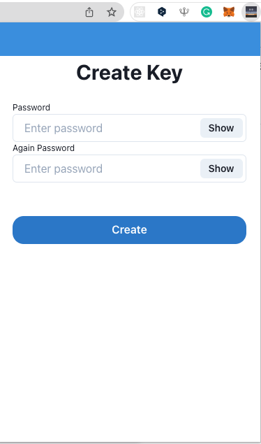

# Identity Wallet browser extension

## What is Identity Wallet

Under Construction...🏗

## Setup

### 1. Clone Repository

Download this program.

```
$> git clone https://github.com/sinsinpurin/identity-wallet-browser-extension.git
```

### 2. Setup

```
$> cd identity-wallet-browser-extension
$> yarn install

$> yarn export
```

### 3. Setup Chrome extension (develop environment)

Go to "Chrome Extension Manager"

Developper mode -> "On"  


Load unpacked -> Select extensions directory  


Pin extension "Identity Wallet"  


### 4. Password setup

Create Key and encrypt the key  


## How to use

Under Construction...🏗
